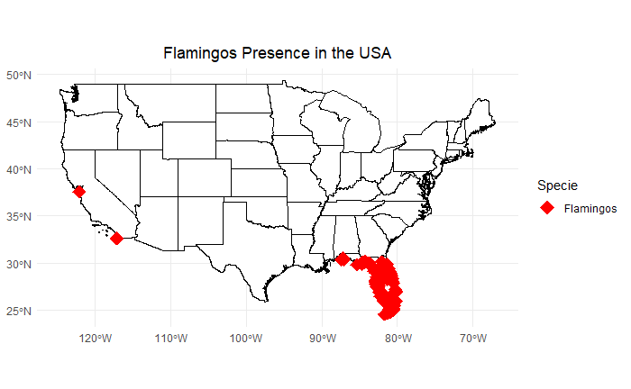
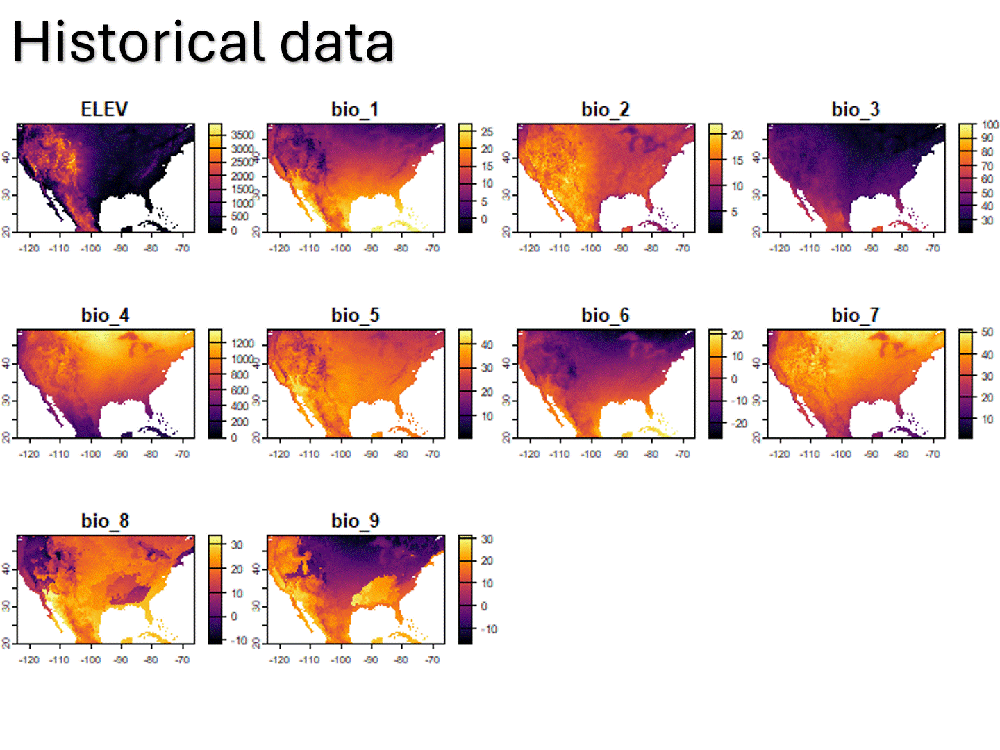
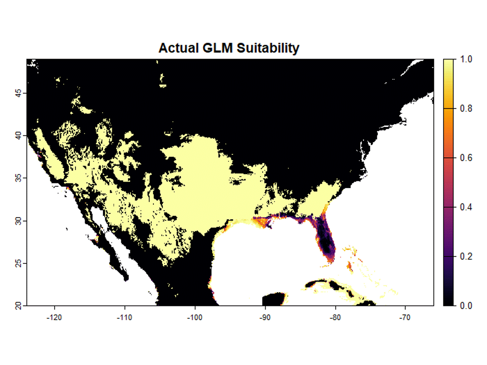
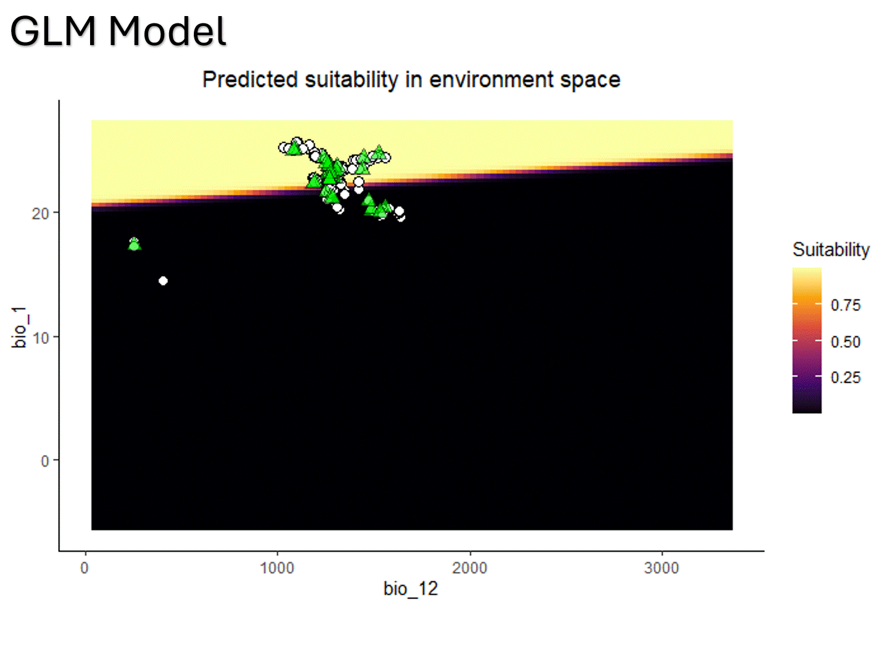
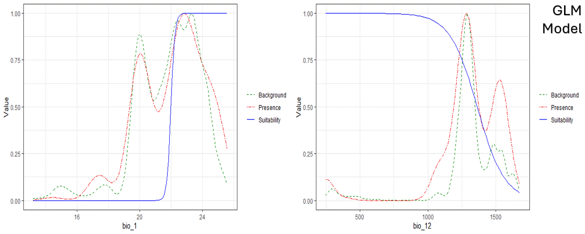
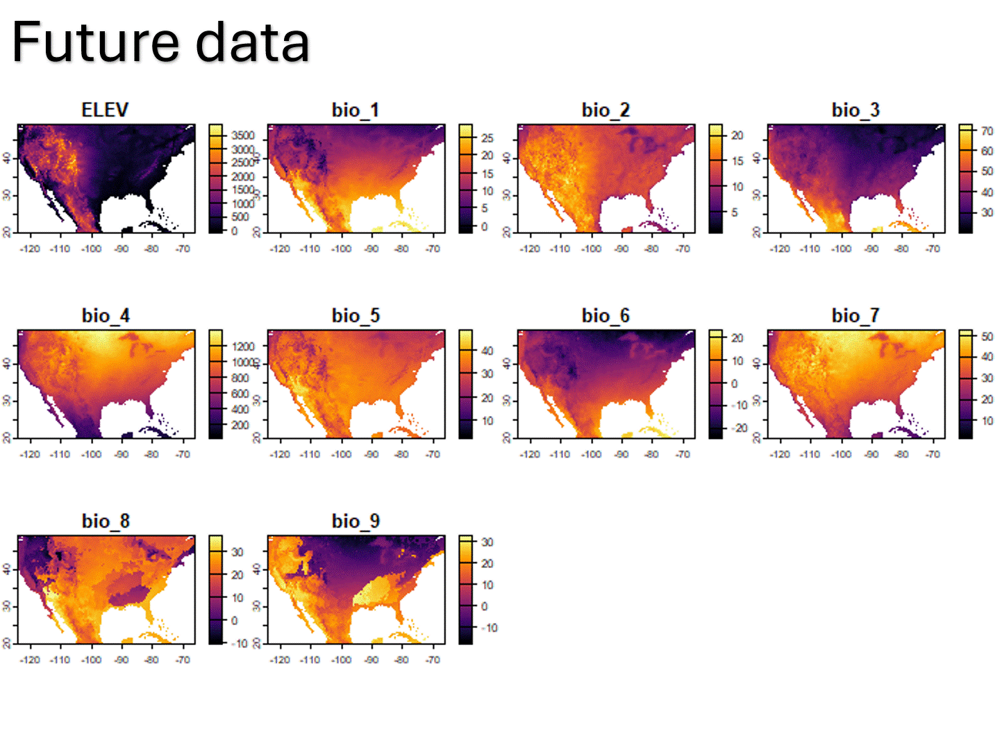
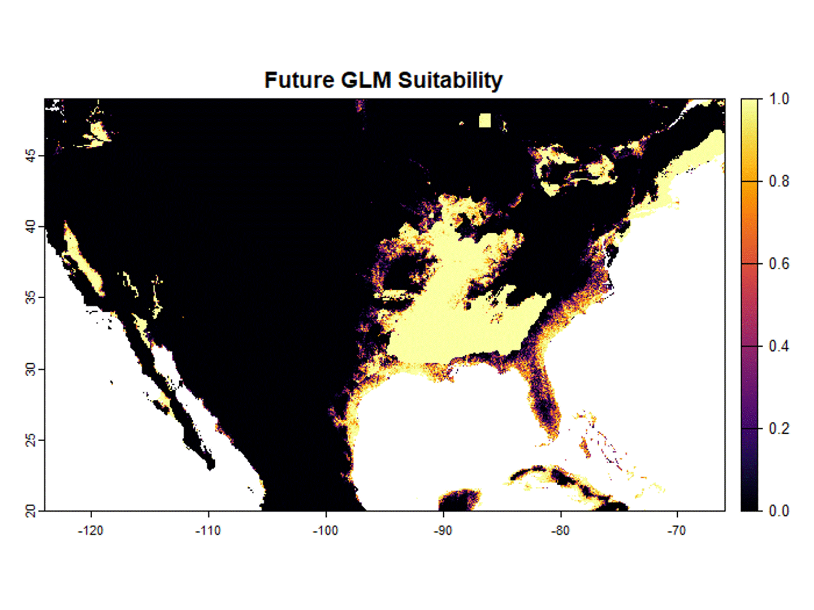

# The Ecological Niche Models finally Arrived! Are you ready?

 

Today I come to bring you a topic that I have wanted to address for a long time but for reasons of time I had not been able to play enough with this, and this topic is the **Ecological Niche Models (ENMs)**. 

So, what exactly are these niche models? At their core, ENMs use complex mathematics to predict where a species could potentially establish itself based on environmental variables. Imagine it like this: every species needs a particular set of conditions—temperature, rainfall, altitude, you name it—to survive. These conditions are what we call variables. An ecological niche is essentially a place where these variables align perfectly to allow a species to exist. Now, what these models do is search for other locations where similar conditions exist, even if the species hasn’t been spotted there yet.

To keep things spicy, let’s focus on a real-world example. Since summer is still hanging on in the U.S., I picked an iconic species of Miami and the state of Florida—the American Flamingo (_Phoenicopterus ruber_). This flamingo isn’t just a pretty face; it’s a window into the fascinating world of ENMs.

Since I have less and less time left, this species allowed me to learn several things about these niche models, so I proceed to present what I found.
 

 

_Figure 1_

In **Figure 1**, you’ll see a map of the continental U.S. with red markers showing where American flamingos have been spotted. Florida, no surprise, is a hotspot, but there are also sightings in California—pretty wild considering it’s on the opposite coast! These points are not just random; they’re crucial in understanding where these flamingos might set up shop. 

For this exercise, I used 
<a target="_blank" href="https://www.worldclim.org/data/bioclim.html">bioclimatic variables</a> from WorldClim, with rasters at a 2.5-minute resolution (Animation 1). Then, I built four niche models: GLM, GAM, Bioclim, and Maxent (Animation 2). These models are trying to predict where flamingos could live. Unsurprisingly, they show that flamingos prefer coastal areas. However, there are some quirks. For instance, GLM suggests that a large part of the southern U.S. could be habitable, while Bioclim is stricter, only considering a few spots in Florida as suitable.

 

_Animation 1_

 

_Animation 2_

Animations 3 and 4 dig deeper, showing how the environment’s suitability for flamingos is showed from the pointview of the average annual temperature (bio_1) and annual precipitation (bio_12). It turns out that while flamingos can tolerate a rise in temperature, too much rain could spell trouble. It’s fascinating to see how these models, even with just bioclimatic variables, narrow down flamingos' potential habitats to coastal areas. Why? Because flamingos are specialized for shallow waters like estuaries, lagoons, and marshes, all nearest to coastal zones where it based it's diet and lifesyle. . 

 

_Animation 3_

 

_Animation 4_

Now, let’s talk about the future. ENMs aren’t just about predicting where species live now; they’re also about forecasting what might happen as the world changes. Animations 1 and 2 show models based on historical and current data, but what if we swap those variables with future scenarios?(Animation 5). 

 

_Animation 5_

That’s exactly what I did in Animation 6, using WorldClim’s SSP370 scenario for the period 2021-2040. The result? A grim picture where suitable habitats shrink dramatically under SSP370, suggesting that flamingos could be in serious trouble if these conditions come to pass.

 

_Animation 6_

**In conclusion**, these models effectively identified suitable habitats for flamingos along the U.S. coast using only precipitation and temperature based variables. A critical factor was the increase in precipitation, which influenced habitat suitability. Future projections showed a decline in habitable areas, except for a glimmer of hope in one specific area identified by the Maxent model. While these are just projections and don't guarantee the species' decline, they underscore the importance of incorporating more variables related to species' lifestyles and taking action on conservation efforts now.

 

## Software used:
-	**R - Rstudio** 
_(it is recommended to use the latest versions)_

## Methodology
- Bioclimatic variables were downloaded from the given <a target="_blank" href="https://www.worldclim.org/data/worldclim21.html">historical data</a> and <a target="_blank" href="https://www.worldclim.org/data/cmip6/cmip6climate.html">future data section</a> of WorldClim.
- Species presence data were downloaded from the <a target="_blank" href="https://www.gbif.org/">GBIF database</a>.
- Using the software R. we followed the step by step tutorial in the <a target="_blank" href="https://github.com/danlwarren/ENMTools">ENMTools repository</a> present on this platform **(if you can, go there to thank the people who created that package, there you will find more technical explanations about what everything is for in that package for R)**.

For those who want to know how to pbtain future projections... This information will only be available to those who give freedom to their curiosity! 

<!--
Literally, just look inside the model object created for example "model.glm$model" and start testing with the predict function, Bioclim and Maxent allow prediction only using the model, but GLM and GAM need the terra.predict() function of the terra package. Remember, future raster files musst be in the same format like "env" objet created in the ENMTools repository example.
-->
 

## Final Words
I've been playing with ecological niche models, using the American flamingo as a test case, and let me tell you, the potential of tools like ENMTools is  amazing. But before you get too excited, there are some crucial things you need to know to avoid the common pitfalls that could make all your efforts go to waste.

First off, did you know that species presence data can be incredibly misleading? Picture this: you find a flamingo in an unexpected location. Naturally, you assume that this place must be suitable for the species, right? Wrong. If you're not careful, you could end up creating maps that wildly overestimate habitat suitability, highlighting areas where flamingos wouldn't naturally thrive. This isn't just a mistake; it's a slippery slope to bad conservation decisions that could do more harm than good.

And then there's the issue of using environmental rasters clipped to geopolitical boundaries, like countries or regions. It might seem practical, but if you're dealing with coastal or edge species, you're setting yourself up for disaster. You could end up with poorly trained models that not only lose accuracy but also waste your time and resources. Do you really want to invest time in a model that, in the end, tells you less than you already knew?

Let’s talk about Maxent, one of the most popular niche modeling tools out there. In my case, this model showed something unexpected: despite the general trend of shrinking habitats for flamingos, it suggested a slight expansion in a specific area. Now, I know this might not be mathematically robust, but isn’t it refreshing to see a glimmer of hope in the data, even amid the doom and gloom of climate change? Not everything has to be bleak, and that's something we should absolutely embrace.

But let’s be clear: as powerful as niche models are, they’re not the be-all and end-all. These models don’t account for crucial factors like competition for resources or human impacts. So, before you jump to conclusions, remember that you’re only seeing part of the picture. But isn’t it thrilling to think about what you could uncover if you start integrating more variables into the mix?

And here’s the kicker: this isn’t just for scientists in fancy labs. Anyone can do this with a bit of dedication. Yes, you too. You don’t need a supercomputer to start experimenting with these models. And here’s the real deal: if everyday people, those who are closest to nature, don’t get involved, we’re losing the battle for sustainability. No data means no analysis; no analysis means no knowledge; and without knowledge, there’s no conservation. It’s that simple.

So, I challenge you to take these tools and make them your own. Play with them, explore, but most importantly, be aware of the impact you can have. This isn’t just about conserving species; it’s about protecting our future. And the best part? You don’t have to be an expert to start making a difference.

Remember Learning new things can be fun!

### **_Thank you to everyone who has read this far._**

 
 

## Annexed animations

_Historical and Future Bioclimatic variables_

 

_Actual vs Future projections_

 

